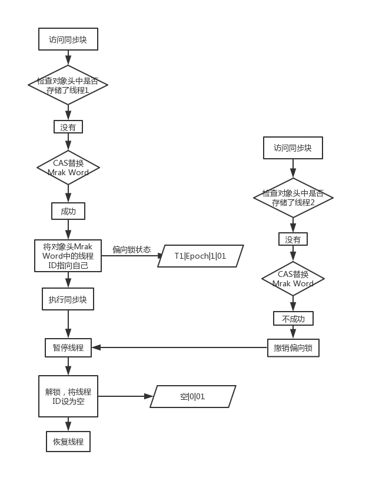

synchronized 一般称之为重量级锁，在Java1.6中对 synchronized 进行了各种优化，在有些情况下它并不那么重了。

## 利用synchronized实现同步的基础

在Java中每一个对象都可以作为锁。具体有以下3中形式：
- 对于普通同步方法，锁是当前实例对象。
- 对于静态同步方法，锁是当前类的 Class 对象。
- 对于同步方法块，锁是 synchronized 括号里配置的对象。

<!-- more -->

**当一个线程试图访问同步代码块时，它首先必须得到锁，退出或抛出异常时必须释放锁。**

* * *

## Java对象头

synchronized 用的锁是存储在Java对象头里的。如果对象是数组类型，则虚拟机用3个**字宽（Word）**存储对象头，如果是非数组对象类型，则用2个字宽存储对象头。

关于Java对象头，参见：[Java对象头详解](/blog/2019/03/15/javase/java-object-head/index.html)

Java对象头里的 Mark Word 里默认存储对象的 **HashCode**、**分代年龄**、**是否是偏向锁** 和 **锁标志位**。32位JVM的 Mark Word的默认存储结构如下：

| 锁状态 | 25bit | 4bit | 1bit是否是偏向锁 | 2bit锁标志位 |
| ------ | ------ | ------ | ------| ------ |
| 无锁状态 | 对象的hashCode值 | 对象分代年龄 | 0 | 01 |
| 无锁状态 | 线程ID、Epoch | 对象分代年龄 | 1 | 01 |

* * *

## 锁的升级与对比

从Java1.6开始，为了减少获得锁和释放锁带来的性能消耗，引入了“偏向锁”、“轻量级锁”。共有4中状态，级别从低到高依次是：**无锁状态**、**偏向锁状态**、**轻量级锁状态** 和 **重量级锁状态**，状态随着竞争激烈逐渐升级。

### 1.偏向锁

**偏向锁的获得**

当一个线程访问同步块并获取锁时，**会在对象头和栈帧中的锁记录里存储锁偏向的线程ID**，以后该线程进入和退出同步块时不需要进行 CAS 操作来加锁和解锁，只需简单地测试一下对象头的 Mark Word 里是否存储着指向当前线程的偏向锁。如果存储，则表示线程已经获得了锁。如果没有存储，则需要再测试一下 Mark Word 中偏向锁的标识是否设置成1（表示当前是偏向锁）：如果没有设置，则使用 CAS 竞争锁；如果已设置，则尝试使用 CAS 将对象头的偏向锁指向当前线程。

**偏向锁的撤销**

偏向锁使用了一种等到竞争出现才释放锁的机制，所以当其他线程尝试竞争偏向锁时，持有偏向锁的线程才会释放锁。偏向锁的撤销，需要等待 **全局安全点**（此时间点没有正在执行的字节码），首先暂停拥有偏向锁的线程，然后检查持有偏向锁的线程释放存活，如果不存活，则将对象头设置为无锁状态；如果依然存活，拥有偏向锁的栈会被执行，此时栈中的锁记录和对象头的 Mark Word 要么重新偏向其他线程，要么恢复到无锁状态或其他锁状态，最后唤醒暂停的线程。

### 2.轻量级锁

**轻量级锁加锁**

1. 线程在执行同步块之前，JVM会先在当前线程的 **栈帧** 中创建用于存储 **锁记录（Lock Record）** 的空间，并将对象头中的 Mark Word 复制到锁记录中，官方称为 **Displaced Mark Word**。

2. 然后线程尝试使用 CAS 将对象头中的 Mark Word 替换为指向锁记录的指针。

3. 如果替换成功，则当前线程获得了该对象的锁，并将该对象的 Mark Word 的锁标志位设置为 “**00**”，表示该对象处于 **轻量级锁状态**。

4. 如果替换失败，虚拟机首先会检查该对象的 Mark Word 是否指向当前线程的栈帧，如果是就说明当前线程已经获得了该对象的锁，即可以直接进入同步块继续执行。否则说明其他线程在竞争锁，当前线程便尝试使用 **自旋（循环争夺锁）** 来获得锁。

**轻量级锁解锁**

1. 通过 CAS 操作尝试把线程中复制的 Displaced Mark Word 替换回对象头的 Mark Word。

2. 如果替换成功，表示没有发生竞争，整个同步过程就完成了。

3. 如果替换失败，表示有其他线程尝试过获取该锁（**此时锁已膨胀成重量级锁**），那就要在释放锁的同时，唤醒被挂起的线程。

* * *

## 锁的优缺点对比

| 锁 | 优点 | 缺点 | 适用场景 |
| ------ | ------ | ------ | ------|
| 偏向锁 | 加锁和解锁不需要额外的消耗，和执行非同步方法相比存在纳秒级的差距 | 如果线程间存在锁竞争，会带来额外的锁撤销的消耗 | 适用于只有一个线程访问同步块的场景 |
| 轻量级锁 | 竞争的线程不会阻塞，提高了程序的响应速度 | 如果始终得不到锁竞争的线程，使用自旋会消耗CPU | 追求响应时间，同步块执行速度非常快 |
| 重量级锁 | 线程竞争不使用自旋，不会消耗CPU | 线程阻塞，响应时间缓慢 | 追求吞吐量，同步块执行速度较长 |
