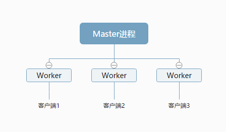
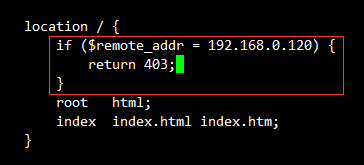

## 一、什么是 Nginx？
Nginx 是一款性能极高的 HTTP 反向代理服务器，Nginx 官方发布的测试数据显示，支持10000非活动的连接只需2.5M内存的性能消耗。同时也是一个邮件服务器。

Nginx的进程模型：**deamon (守护)**。

 **Nginx的优势：**
 - 1、Nginx采用多进程模型：**Master**、多个 **Worker** (独立进程，不需要锁，避免了锁带来的性能开销)
 - 2、异步非阻塞 **(NIO)**



<!-- more -->

## 二、Nginx安装与命令

### 安装：

Linux 下安装 Nginx：

 - 1、下载 nginx 的 linux 版本。
 - 2、解压：
```shell
tar -zxvf nginx-1.*.tar.gz
```
 - 3、设置 nginx 安装的配置信息，指定安装路径：
```shell
./configure --prefix=/usr/***
```
 需要 gcc 依赖，
```shell
ubuntu:
apt-get install gcc

centos:
yum -y install gcc
```
 需要PCRE库的依赖，下载并解压pcre。
 (CentOS下直接：`yum -y install pcre-devel`)，或还依赖zlib-devel，安装同理。

 配置：
 ```shell
 ./configure --prefix=/usr/soft/pcre/pcre-bin/
 ```
 配置Nginx：
 ```shell
 ./configure --prefix=/usr/soft/nginx/nginx-1.10.3-bin/ --with-pcre=/usr/soft/pcre/pcre-8.41/
 ```

 - 4、编译：make
 - 5、安装：make install

Windows下直接下载解压即可。

### 命令：

**启动**：（CentOS下需要关闭防火墙）

 ```shell
 NGINX_HOME/sbin/nginx -c NGINX_HOME/conf/nginx.conf
 ```

**停止**：
1. 信号灯：
 1. **从容停止：`kill -QUIT [nginx master进程号]`**
 2. **快速停止：`kill {-TEAM|INT} [nginx master进程号]`**
 3. **`kill -9`**

2. 命令方式：

 ```shell
 GINX_HOME/sbin/nginx -s stop
 ```

3. 配置文件重新加载：

 ```shell
 NGINX_HOME/sbin/nginx -s reload
 ```

 校验nginx.conf文件的语法格式：
 ```shell
 NGINX_HOME/sbin/nginx -t
 ```

## 三、Nginx配置文件

```perl
# Main 段，定义全局属性

# 表示有一个工作子进程，默认为1，一般配置为CPU的核心数，或两倍于CPU核心数
worker_processes 1;

# 定义错误日志，日志级别：[ debug | info | notice | warn | error | crit | alert | emerg ]
#error_log  <file_path> <level>
#error_log  logs/error.log;
#error_log  logs/error.log  notice;
#error_log  logs/error.log  info;

#pid        logs/nginx.pid;

# 定义不同IO模型下的工作机制
events {
    # 定义事件类型，系统默认会根据系统选择最优的方式
	# epoll | select | ......
    #use epoll;
    # 设置一个工作进程最大允许多少个连接
    worker_connections 1024;
}

http {
    # 作为web服务器的相关属性
    server { # 定义一个虚拟主机
	    # 定义一个url定位
        location [option] url {
    }
}
    server {}
    ......
    upstream <name> {
        # 将多个server结合实现负载均衡
    }
}

```

## 四、Nginx虚拟主机配置

 - **基于域名**
修改server_name映射域名。

 - **基于端口**
修改listen映射的端口号。

 - **基于IP**
修改server_name映射为IP地址。

## 五、Nginx日志管理

```perl
# Log声明 路径及文件名 日志标识
#log_format  main  '$remote_addr - $remote_user [$time_local] "$request" '
#                  '$status $body_bytes_sent "$http_referer" '
#                  '"$http_user_agent" "$http_x_forwarded_for"';

#access_log  logs/host.access.log  main;
```

## 六、location配置

location 在 server 配置中可以存在多个，主要实现定位功能，根据uri进行不同的定位。

**语法：location [=|~|~*|^~] /uri/ {......}**

=：表示精确匹配
^~：表示uri以某个常规字符串开头，相当于匹配uri路径
~：区分大小写的正则匹配
!~：区分大小写不匹配
!~*：不区分大小写，不匹配
~*：不区分大小写的正则匹配
/：通用匹配

**匹配种类：**
  - 精准匹配
  - 一般匹配
  - 正则匹配

**匹配优先级：**

 - 1、首先匹配精准匹配。
 - 2、如果两个location都是一般匹配规则，那么会按照最长路径匹配。
 - 3、一般匹配和正则匹配的过程是：
 **_首先会选择一般匹配过程中的大前缀匹配，但是匹配过程不会停止，最大前缀匹配只是一个临时结果，nginx还会继续检查正则location。
 按照正则location在配置文件的物理顺序做匹配，如果匹配到一条正则location，就不会考虑后面的规则。_**

## 七、Rewrite重写

支持url重写。

**常用指令：**

 - **if 指令：**
语法：if 空格 (condition条件) {}
条件：
1、“=” 来判断相等，用于字符的比较。
2、“~” 正则匹配（表示区分大小写），“~*” 不区分大小写
3、“-f|-d|-e” 判断是否为文件|目录|是否存在

 - **return 指令：**
语法：return code/url;
作用：停止处理并返回状态码给客户端。

 - **rewrite 指令：**
语法：rewrite regex replacement; flag;
flag：last/break/redirect/permant
作用：用于请求重定向。

 - **set 指令：**
语法：set variale value;
作用：定义一个变量并赋值。

**例如**：对远程指定IP进行限制访问：
```perl
if ($remote_addr = 192.168.0.120) {
    return 403;
}
```



## 八、gzip压缩

gizp主要对内容、静态文件做压缩，用来提升网站访问速度，节省带宽。
gzip可以在http作用范围内配置，也可以对单独一台虚拟主机进行配置。

**gzip相关配置：**
gizp on | off 是否开启。
gzip_buffer 32 4k  设置系统获取多少个单位的缓存用于存储gzip的压缩结果数据流，即以32乘4k的大小去申请缓冲区，128k。
gzip_comp_level [1-9] 压缩级别，值越高，压缩的内容越小。
gzip_min_length 200 开始压缩的最小长度，大于200B的文件进行压缩。
gzip_types 对哪些文件做压缩处理。
gzip_vary on|off 是否传输gzip压缩标识。
gzip_disable 正则匹配UA,表示对指定的浏览器不做gzip压缩。

<font color="red">
注意：
1、图片、mp3、视频之类大文件，压缩会损耗CPU资源。
2、太小的文件没必要压缩，200B大小的文件压缩后会添加一些压缩信息，会变成210B大小。
</font>